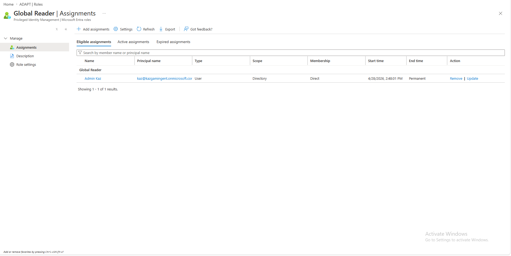
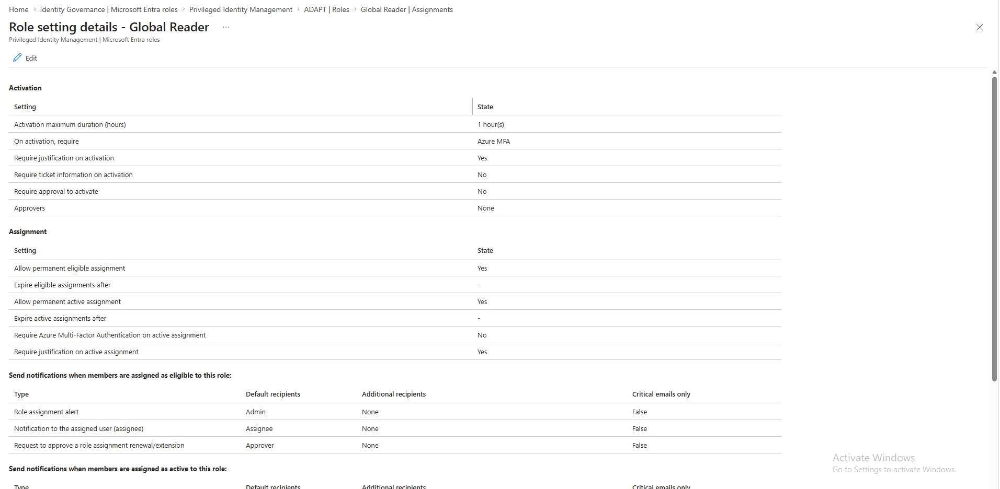
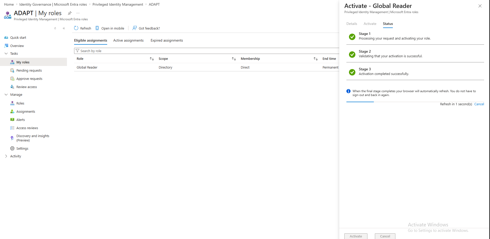
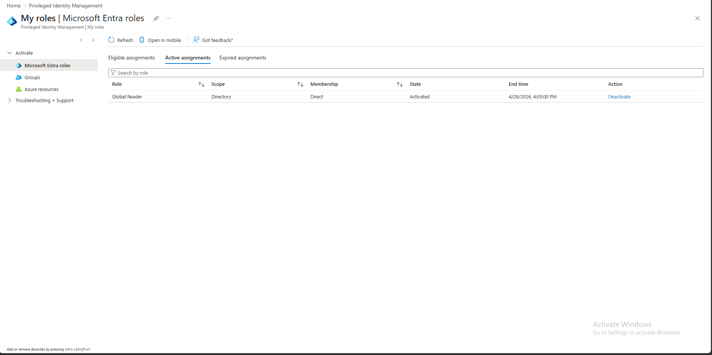
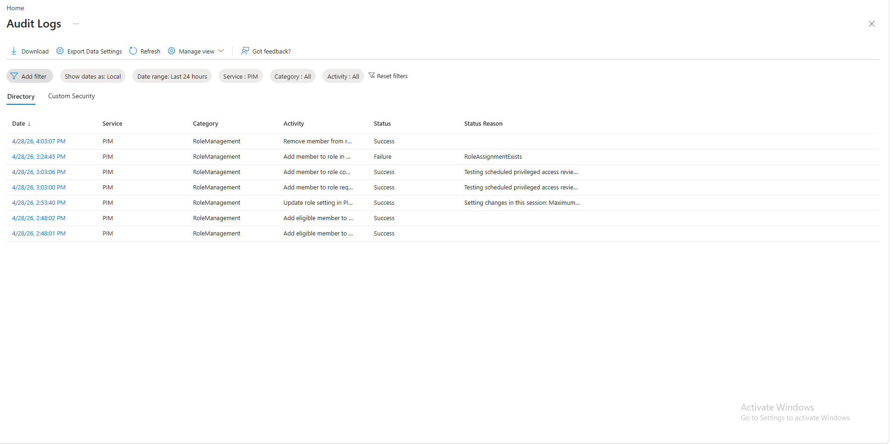

# Project 6 – Privileged Identity Management (PIM) and Just-In-Time Access in Microsoft Entra ID

---

## Overview

This project demonstrates the implementation of **Just-In-Time (JIT) privileged access** using **Microsoft Entra Privileged Identity Management (PIM)**. Instead of assigning permanent admin roles, a dedicated admin account was configured as eligible for the Global Reader role — requiring MFA, a written justification, and a 1-hour maximum activation window before access is granted. All privileged activity was captured in PIM audit logs, mirroring the Privileged Access Management controls used in enterprise zero-trust environments.

---

## Environment

| Tool | Purpose |
|------|---------|
| Microsoft Azure Portal | Cloud identity management platform |
| Microsoft Entra PIM | Just-In-Time privileged role activation and governance |
| Azure Audit Logs | Privileged activity logging and export |
| MFA (Microsoft Authenticator) | Required on role activation |
| GitHub | Documentation and version control |

---

## Lab Design

### PIM Role Configuration

| Setting | Value |
|---------|-------|
| Role | Global Reader |
| Assignment Type | Eligible (not permanent) |
| Activation Duration | 1 hour maximum |
| MFA Required | Yes — Azure MFA on activation |
| Justification Required | Yes |
| Approval Required | No |
| Scope | Directory |

---

## Build Walkthrough

---

### 🟡 Step 1 — Assigned Eligible Role in PIM

Navigated to Microsoft Entra ID > Identity Governance > Privileged Identity Management > ADAPT Roles. Added Admin Kaz as an Eligible assignment for the Global Reader role scoped to the Directory. Assignment type set to Permanent eligible — meaning the user can activate the role on demand but does not hold it by default. Confirmed the assignment appeared under Eligible Assignments with the correct principal name and start time.

*PIM Global Reader Eligible Assignments — Admin Kaz assigned as eligible, Permanent, Directory scope confirmed*

---

### 🔵 Step 2 — Reviewed Role Setting Details

Opened the Role Setting Details for Global Reader to confirm all activation controls were configured correctly. Verified MFA is required on activation, justification is required, activation maximum duration is set to 1 hour, and justification on active assignment is required.

**Role Settings Confirmed:**
- Activation maximum duration: 1 hour
- On activation, require: Azure MFA
- Require justification on activation: Yes
- Require approval to activate: No

*Global Reader role setting details — MFA required, 1 hour max duration, justification required confirmed*

---

### 🟠 Step 3 — Activated Global Reader Role via PIM

Logged in as Admin Kaz and navigated to PIM > My Roles > Eligible Assignments. Clicked Activate on the Global Reader role, entered a justification, and completed the MFA prompt. The activation panel showed all three stages completing successfully — Processing request, Validating activation, and Activation completed successfully.

*PIM activation panel — all three stages completed successfully for Global Reader role*

---

### ✅ Step 4 — Verified Active Assignment Post-Activation

Navigated to PIM > My Roles > Active Assignments to confirm the Global Reader role was now active. The role appeared with State: Activated, End time set to 4/28/2026 4:03:00 PM — confirming the 1-hour window was enforced and a Deactivate option was available.

*PIM Active Assignments — Global Reader role Activated with 1-hour end time and Deactivate action confirmed*

---

### ✅ Step 5 — Reviewed PIM Audit Logs

Navigated to Entra ID > Monitoring > Audit Logs and filtered by Service: PIM. Logs confirmed the full privileged access lifecycle — eligible role assignment, role setting update, role activation request, role activation completion, and role removal — all captured with timestamps and Success status. One Failure entry with reason RoleAssignmentExists was also visible, confirming the audit log captures both successful and failed privileged actions.

*PIM Audit Logs — RoleManagement events including Add eligible member, Update role setting, Add member to role, and Remove member from role all logged with timestamps*

---

## Final Summary

| Action | PIM Control | Result |
|--------|------------|--------|
| Assigned eligible role | Eligible assignment — not permanent | Global Reader eligible for Admin Kaz |
| Configured role settings | MFA + justification + 1 hour max | Controls enforced on every activation |
| Activated role via PIM | MFA completed, justification entered | All 3 activation stages passed |
| Verified active assignment | Active Assignments blade | Role active with timed expiry confirmed |
| Reviewed audit logs | PIM audit log filter | All privileged events logged with Success |

---

## Skills Demonstrated

| Skill | How It Was Applied |
|-------|--------------------|
| Privileged Identity Management | Configured PIM eligible assignments for a dedicated admin account |
| Just-In-Time Access | Replaced standing privilege with time-limited on-demand activation |
| MFA Enforcement | Required Azure MFA on every role activation |
| Role Governance | Set activation duration, justification, and approval requirements |
| Audit Log Review | Filtered and reviewed PIM-specific events in Entra audit logs |
| Zero Trust Principles | Applied least-privilege and JIT access as core identity controls |
| Dedicated Admin Account | Separated privileged identity from standard day-to-day account |

---

## Lessons Learned

**Standing privilege is a standing risk.** Permanently assigning admin roles means that if an account is compromised at any time — whether the user is actively working or not — the attacker immediately has admin access. PIM eliminates this by making privilege something that must be actively requested, justified, and time-limited. The attack window shrinks from always-on to one hour maximum.

**MFA on activation is not the same as MFA on login.** Requiring MFA at login is standard. Requiring MFA again at the moment of privilege elevation is a separate and stronger control. It means that even if an attacker has already authenticated as the user, they still cannot elevate without passing a second MFA challenge at the exact moment they attempt to gain admin rights.

**The audit log captures failures too.** The RoleAssignmentExists failure entry in the audit log is not a problem — it is a feature. In a real environment, unexpected failures in privilege management logs are exactly what a SOC analyst or IAM engineer investigates. Knowing how to read both successes and failures in PIM audit logs is a practical skill that directly applies to incident response and access reviews.

---

## Real-World Application

Privileged account compromise is the most common path to a full environment breach. Standing admin rights — roles that are always active — are a critical vulnerability that PIM directly eliminates. Enterprise environments under SOC 2, ISO 27001, and NIST 800-53 are required to implement PAM controls, and auditors specifically look for evidence of JIT access, MFA on elevation, and audit trails for all privileged actions. This project demonstrates the exact controls that identity security engineers and IAM analysts implement and maintain in production Azure environments every day.

---

## References

- [Microsoft Entra PIM Documentation](https://learn.microsoft.com/en-us/azure/active-directory/privileged-identity-management)
- [Azure Audit Logs Overview](https://learn.microsoft.com/en-us/azure/active-directory/reports-monitoring/concept-audit-logs)
- [NIST SP 800-53 – Privileged Account Management](https://csrc.nist.gov/publications/detail/sp/800-53/rev-5/final)
- [Zero Trust Architecture – NIST SP 800-207](https://csrc.nist.gov/publications/detail/sp/800-207/final)
